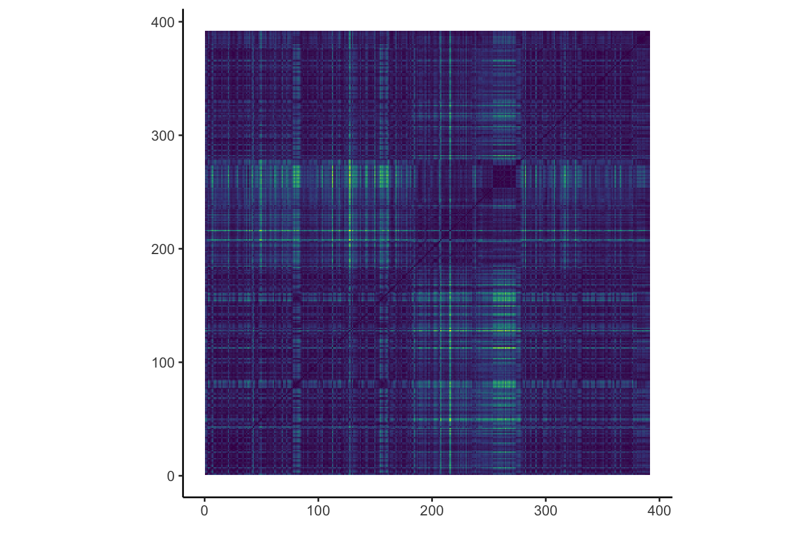
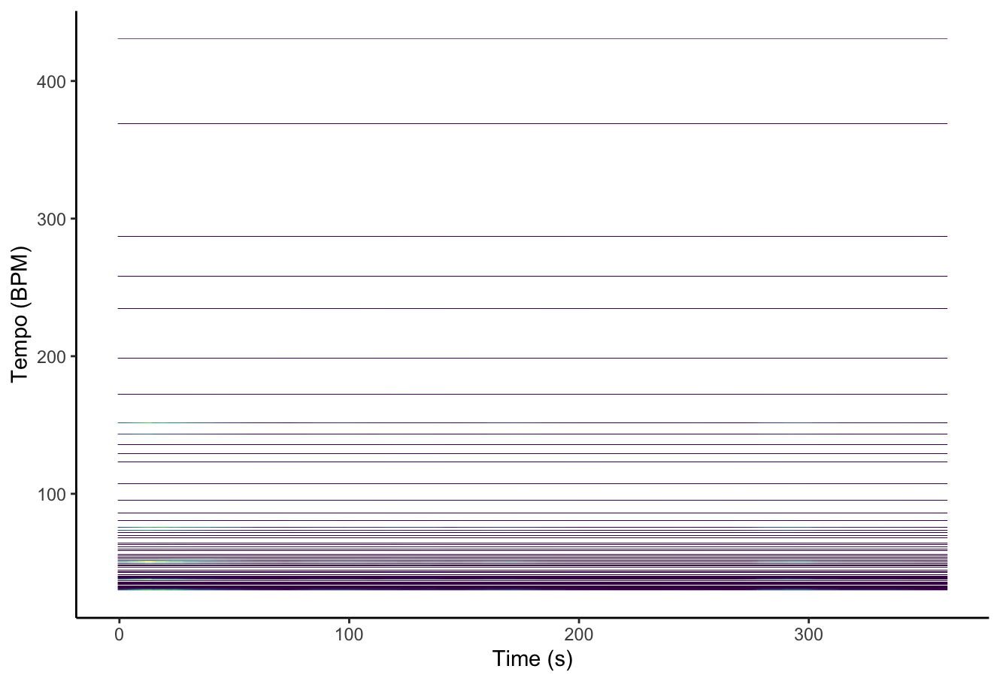
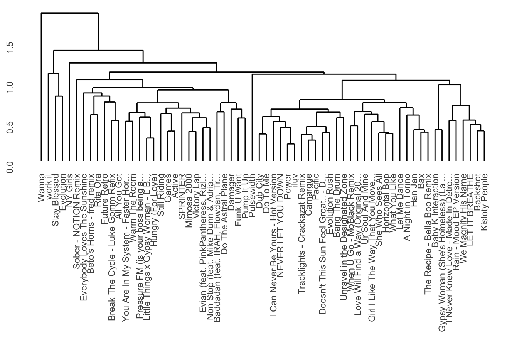

# Project Description {#overview}
My corpus consists of my personal Spotify “Top Songs” playlists from 2022 and 2025 which were two years that correspond to major geographic and identity transitions in my life. In 2022, I moved from the United States to Vancouver, marking a shift in environment, social networks, and lifestyle. In 2025, after three formative years in Vancouver, I relocated to the Netherlands. I treat each year’s Top Songs playlist as a snapshot of my musical identity at that moment in time.

Using Spotify’s track-level audio features, I aim to examine how my listening patterns changed across these two transitions. By comparing feature distributions and stylistic clusters between 2022 and 2025, I explore whether shifts in geography and cultural exposure are reflected in measurable differences in musical characteristics. This project frames music taste as autobiographical data, investigating how relocation and cultural context may shape evolving personal identity through music.

## Column {width=60%}

### Summary


### Plot 1
```{r}
# Tempogram {#tempogram}
The tempogram for “New Person, Same Old Mistakes” shows a very stable tempo throughout the track. The strongest horizontal bands appear around roughly 35–40 BPM and its multiples (around 70–80 BPM and 140–160 BPM). These layers represent the same underlying pulse being detected at different metrical levels, such as half-time, beat level, and double-time.

The consistency of these bands across the entire time axis suggests that the song maintains a steady tempo with little fluctuation, which is typical for electronically produced music. Instead of tempo changes, the track creates movement through gradual changes in texture, layering, and timbre.

Overall, the tempogram highlights the song’s stable rhythmic foundation, which supports its hypnotic groove and repetitive structure.

## Column {width=60%}

### Summary


#####
### Plot 2
```{r}
# Dendrogram {#dendrogram}
This dendrogram shows how my 2025 playlist clusters based on audio features using average linkage. Because it uses average distances, the clusters are more balanced and not too extreme.

Overall, most tracks merge at relatively low heights, which suggests that a lot of the playlist is pretty similar in terms of sound (like energy, tempo, etc.). This makes sense since my listening habits tend to stay within a certain vibe.

There are still some smaller clusters that form early, showing groups of songs that are especially similar, probably reflecting specific styles or moods. At the same time, a few tracks only join at higher distances, which suggests some outliers that don’t fit as closely with the rest.

Overall, the playlist feels cohesive, with some subtle variation rather than really distinct or separate groups.

## Column {width=60%}

### Summary
