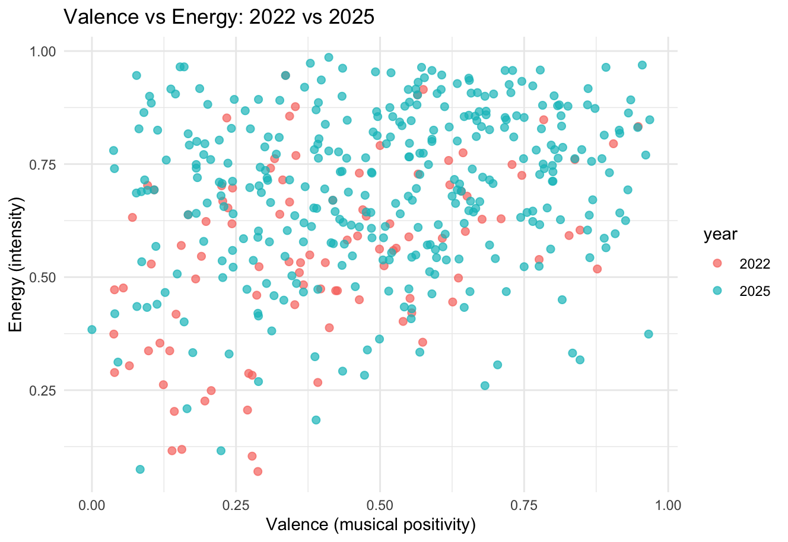
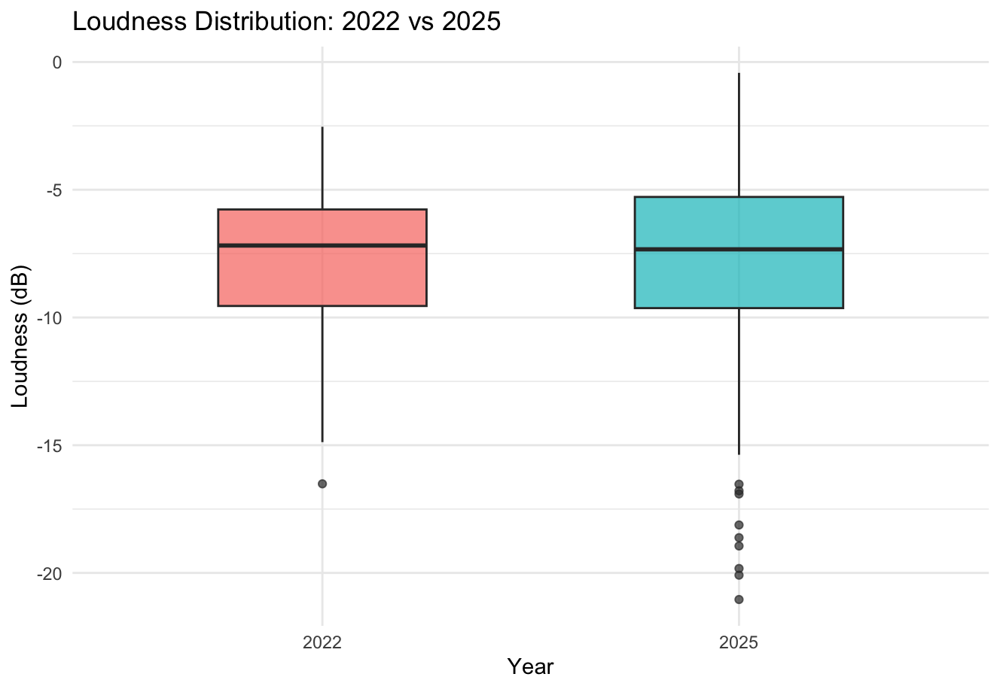
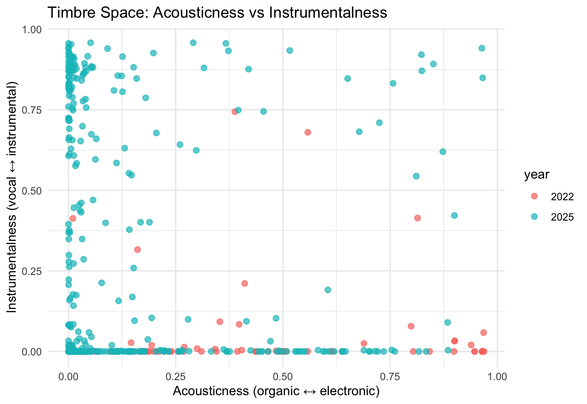
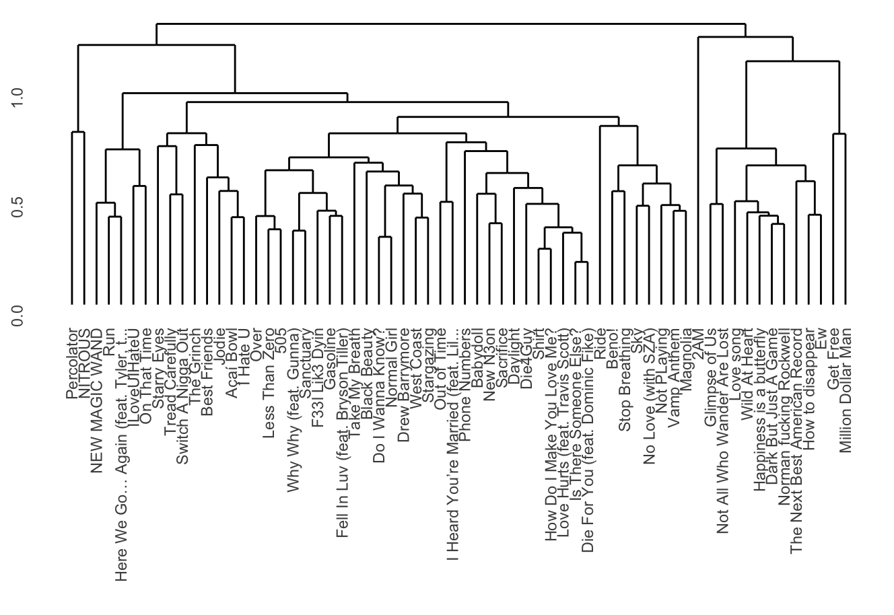
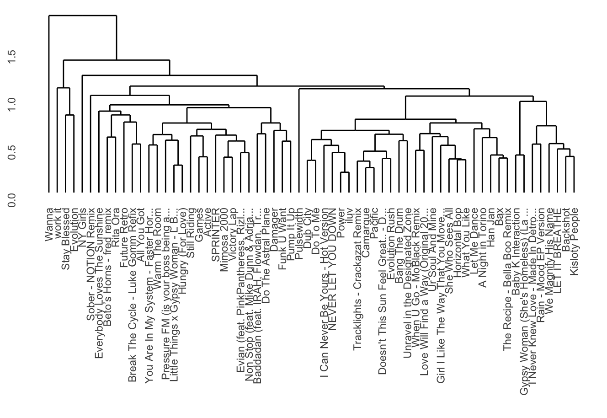
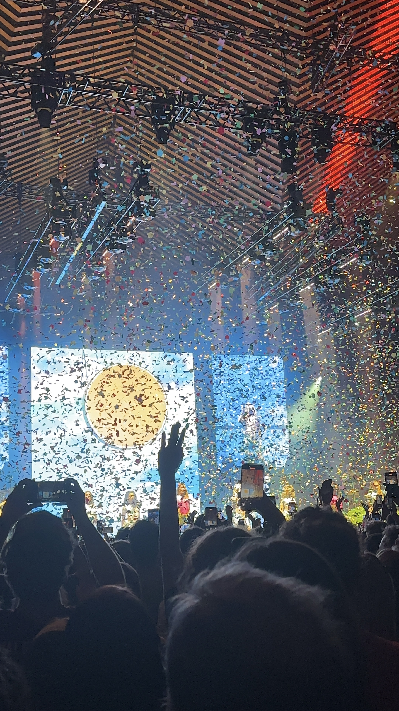

# Project Description {#overview}
This project examines how my music listening habits reflect shifts in personal identity across major geographic transitions. My corpus consists of my personal Spotify “Top Songs” playlists from 2022 and 2025, which correspond to two distinct periods in my life. In 2022, I moved from the United States to Vancouver, marking a significant change in environment, social context, and daily life. In 2025, I relocated again to the Netherlands after several formative years abroad. I treat each playlist as a snapshot of my musical identity at a specific moment in time.

Rather than viewing these playlists as static collections of songs, I approach them as autobiographical data. Music listening is often shaped by context like where we are, who we are around, and how we experience daily life, so changes in location may be reflected in changes in musical preferences. This project explores whether these shifts can be observed through computational analysis.

Using Spotify’s track-level audio features alongside more detailed representations such as chroma, timbre, and temporal features, I compare the 2022 and 2025 playlists to identify patterns and differences. I aim to investigate whether relocation and cultural exposure correspond to measurable changes in musical characteristics, and to what extent these features can meaningfully represent changes in personal identity. At the same time, this project acknowledges that computational features may not fully capture the subjective and cultural dimensions of music listening, and therefore treats its findings as partial rather than definitive representations of musical identity.

## Column {width=60%}

### Summary

### Plot 0
# Track-Level Features {#features}
The scatterplot comparing valence and energy across my 2022 and 2025 playlists reveals both continuity and subtle shifts in my musical preferences over time. Overall, tracks from both years occupy a similar general region of the space, with most songs falling in the mid-to-high energy range (around 0.5–0.9) and moderate to high valence. This suggests a consistent preference for music that is relatively energetic and emotionally positive, indicating a stable underlying musical identity despite major geographic transitions.

However, there are noticeable differences between the two years. The 2025 playlist appears more widely distributed across the valence axis, extending further into both higher and lower values compared to 2022. In contrast, the 2022 tracks are more tightly clustered, particularly in the lower-to-mid valence range. This suggests that my listening habits in 2025 may be more diverse in emotional tone, potentially reflecting increased exposure to different musical styles or cultural contexts following relocation.

Additionally, the density of points in 2025 is higher overall, with a concentration of tracks in the upper-right quadrant (high valence, high energy), indicating a possible shift toward more upbeat and intense music. At the same time, the presence of lower-valence tracks suggests that this shift is not uniform, but rather reflects a broader exploration of different moods.

In the context of this project, these patterns suggest that while my core preference for energetic music remains stable, my emotional and stylistic range has expanded over time. This supports the idea that musical identity is not entirely replaced through life transitions, but instead evolves by incorporating new influences. However, it is important to note that features such as valence and energy are simplified representations of complex perceptual qualities, and may not fully capture the subjective or contextual aspects of how music is experienced.

## Column {width=60%}

### Summary

#####

### Plot 1
# Chroma Features {#chroma}
This self-similarity matrix of chroma features reveals clear repeating structural patterns over time, visible through the grid-like blocks along the diagonal. These blocks indicate sections of the track that share similar harmonic content, reflecting the repetitive chord progressions typical of this song. Because chroma features capture pitch class information independent of timbre and octave, they highlight the underlying harmonic structure rather than surface-level sound differences.

In the context of my project, this is especially meaningful because I am comparing two versions of the same song across different years in my life (Same Ol’ Mistakes by Rihanna and New Person, Same Old Mistakes by Tame Impala). The strong self-similarity patterns suggest that the harmonic content remains highly stable throughout the track, and by extension, across both versions. This reinforces the idea that chroma features capture what is consistent between them: the chord progression and tonal structure.

However, despite this apparent similarity in pitch representation, the listening experience of the two versions is quite different. This highlights a key limitation of chroma features—they do not account for timbre, texture, or production differences, which are likely the factors driving my shift in preference from one version to the other. In this sense, the chromagram supports a broader insight of this project: while computational features can reveal structural similarities, they do not fully capture the perceptual and contextual aspects that shape musical identity.

## Column {width=60%}

### Summary

#####

### Plot 2
# Loudness {#loudness}
The boxplot comparing loudness distributions between my 2022 and 2025 playlists shows that overall loudness levels remain relatively similar across both years, with median values clustering around roughly -7 to -8 dB. This suggests a consistent preference for moderately high-energy, commercially produced tracks, which are typically characterized by compressed audio and stable loudness levels.

However, there are some notable differences in variability. The 2025 playlist exhibits a slightly wider spread, particularly in the lower range, with more extreme quiet outliers (reaching below -20 dB). This indicates a broader range of dynamics and suggests that my listening habits in 2025 may include a more diverse set of production styles, including tracks with less compression or more subtle, quieter passages.

In contrast, the 2022 playlist appears more tightly distributed, implying a more consistent loudness profile across tracks. This could reflect a stronger preference at the time for mainstream or high-energy music with uniform production characteristics.

In the context of my project, these results suggest that while my overall preference for a certain level of sonic intensity has remained relatively stable across geographic transitions, my later listening habits have become more varied. At the same time, loudness as a feature reflects production and signal energy rather than perceived emotional intensity, meaning that these differences should be interpreted cautiously. This reinforces a broader limitation of computational analysis: even when measurable differences exist, they do not fully capture the subjective and contextual aspects of musical identity.

## Column {width=60%}

### Summary

#####

### Plot 3
# Timbre as Perceptual Space {#timbre}
Timbre is one of the most difficult musical features to define computationally, yet it is one of the most immediately recognizable aspects of sound for human listeners. While we can easily distinguish between voices, instruments, or production styles, these differences are challenging to capture in precise numerical terms. To approximate timbre in this project, I map tracks into a simplified perceptual space using acousticness (organic vs electronic sound) and instrumentalness (vocal vs instrumental texture).

The resulting distribution reveals a strong clustering pattern across both years. Most tracks lie either along the lower edge of the plot (very low instrumentalness), indicating a strong preference for vocal-heavy music, or along the left side (low acousticness), indicating predominantly electronic or heavily produced sounds. This suggests that, despite changes in location and context, my core timbral preference remains relatively stable: I tend to favor vocal-driven, electronically produced music.

At the same time, the 2025 playlist shows a noticeably broader spread along the instrumentalness axis, with many more tracks extending into higher values. This indicates a greater presence of instrumental or less vocal-centric music compared to 2022, suggesting an expansion in the types of textures I engage with. There is also slightly more dispersion across acousticness values, pointing to increased variation in production styles.

From a psychological perspective, this highlights an important tension in how timbre is represented. Although features like acousticness and instrumentalness provide a structured way to visualize sound, they only approximate perceptual experience. Humans can effortlessly recognize subtle differences in timbre—such as warmth, brightness, or texture—without needing explicit definitions. In contrast, computational features reduce these rich perceptual qualities to simplified dimensions. The fact that clear patterns still emerge in this reduced space suggests that these features capture some meaningful aspects of auditory perception, even if they cannot fully represent it.

In the context of my project, this visualization suggests that my musical identity is characterized by a stable core preference for certain timbral qualities, alongside a gradual expansion in the range of textures I explore. This supports the broader idea that identity is not completely transformed across life transitions, but rather evolves by incorporating new perceptual and aesthetic experiences.

## Column {width=60%}

### Summary

##### 

### Plot 4
# Tempogram {#tempogram}
The tempogram for New Person, Same Old Mistakes (from my 2025 playlist) shows a highly stable tempo throughout the track. The most prominent horizontal bands appear around approximately 35–40 BPM and its multiples (around 70–80 BPM and 140–160 BPM), which reflect the same underlying pulse being interpreted at different metrical levels, such as half-time and double-time.

These bands remain consistent across the entire duration of the track, indicating that the tempo does not significantly fluctuate. This kind of stability is typical of electronically produced music, where timing is tightly controlled. Rather than creating variation through tempo changes, the track relies on gradual shifts in texture, layering, and timbre to produce a sense of movement.

In the context of my project, this stable rhythmic structure is interesting because it suggests that certain aspects of musical identity (which seems to be a preference for steady, groove-based tracks) remain consistent even across different periods of my life. While other features like timbre or emotional tone may shift, the underlying rhythmic foundation of the music I listen to appears relatively stable.

## Column {width=60%}

### Summary

#####
### Plot 5
# Dendrograms {#dendrogram}
To compare my listening habits over time, I applied hierarchical clustering to both playlists using the same features, limiting each to 64 tracks for consistency.

The 2022 dendrogram (top) is relatively cohesive, with most tracks merging at lower distances. This suggests a more uniform listening profile. For example, Less Than Zero by The Weeknd and 505 by Arctic Monkeys cluster closely, reflecting a shared atmospheric, mid-tempo feel, while tracks like The Spins and Electric Feel form a slightly more upbeat cluster but still fit within a consistent overall sound.

In contrast, the 2025 dendrogram (bottom) is more spread out, with clusters merging at higher distances, indicating greater variation. Tracks like Climax (hyperpop/club-oriented) sit far from more atmospheric songs like Kiss Me or Backshot, reflecting differences in energy, timbre, and production style. There are also clearer sub-groups, such as high-energy electronic tracks clustering separately from softer, more introspective ones.

Overall, this shift suggests that my musical preferences have become more diverse over time. While 2022 reflects a more concentrated “core” sound, 2025 shows a broader range of styles. At the same time, consistent clustering within both playlists suggests that my musical identity has expanded rather than fundamentally changed.

## Column {width=60%}

### Summary

#####
### Plot 6
# Contribution {#contribution}
This project showed me that my music taste is both more consistent and more flexible than I expected. Some aspects, like my preference for relatively high-energy tracks, stay pretty stable across 2022 and 2025. At the same time, other features (especially timbre and emotional range) become more varied, suggesting that my musical identity hasn’t changed completely, but has expanded.

One thing I found especially interesting is how hard timbre is to represent. It’s something we notice instantly when listening, but it doesn’t translate cleanly into features. Even when two songs look similar in terms of harmony or tempo, they can feel very different because of how they sound. This made it clear that computational features capture structure well, but miss a lot of the perceptual side of music.

More generally, this project shows how playlists can reflect changes in context and experience over time. This could be useful for recommendation systems, which often rely on simplified features and might miss how people actually experience music. From a psychology perspective, it also highlights how music relates to identity—some preferences stay consistent, while others shift depending on environment and exposure.

## Column {width=60%}

### Summary

